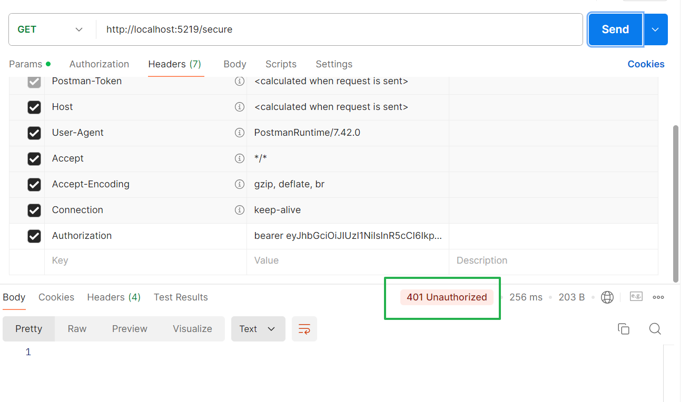

# 設置重點提示
在專案的appsettings.json 中，在JWT 中的KEY 宣告自己的KEY種子

# 驗證方式
-  使用**POSTMAN**工具，在**POST** 的 **Body**頁籤中，將正確的 username及password 使用JASON 方式輸入 
-  送出後，收到500錯誤。提示種子至少要256 bit，我們只有160 bit (20個字)

- 我們加字，再重新執行程式。再用POSTMAN 重新發送請求，程式比對username 及  password 都正確，就會返回 JWT Token

**JWT Token** 就是下圖綠色圈起來的文字

